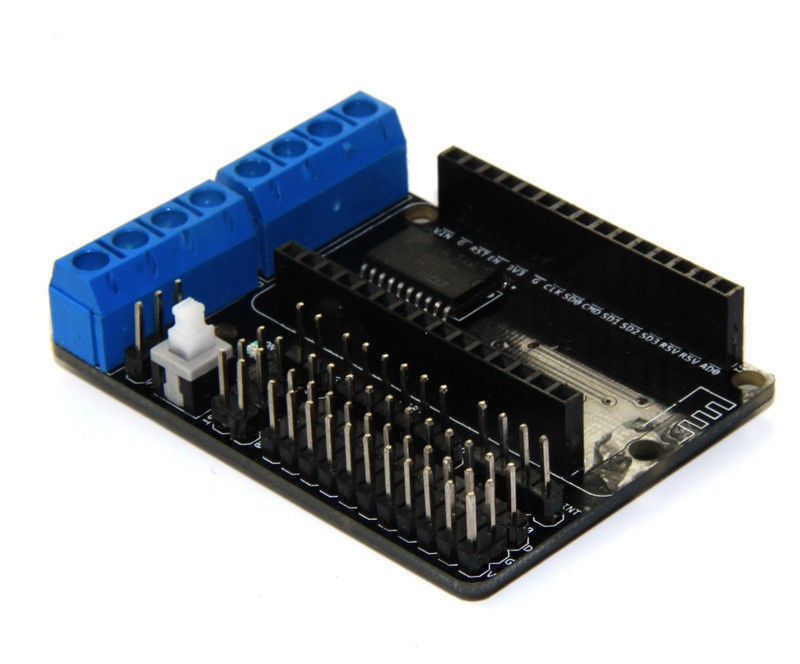
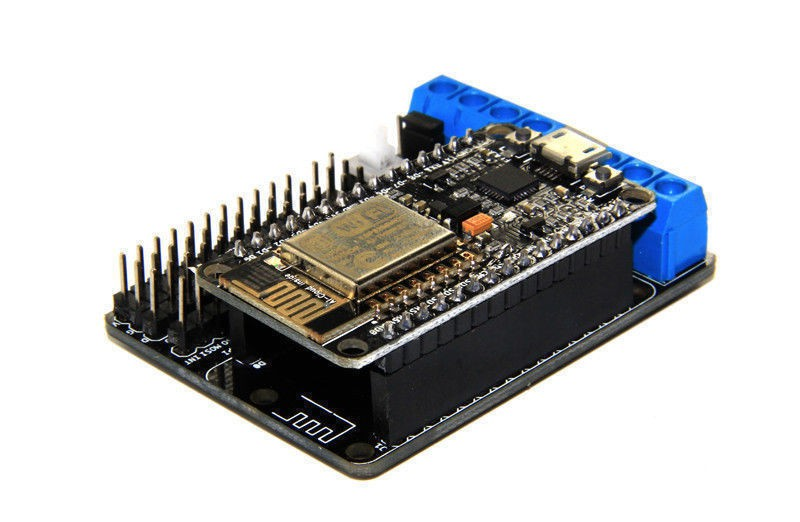
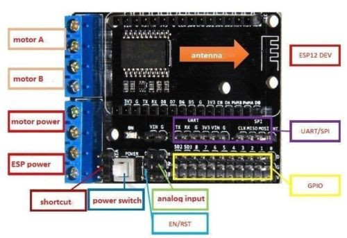
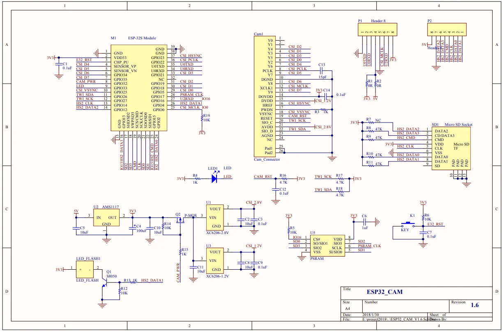

# IOT SERVER 
- settings and scripts for my home assistant setup
- docker containers for 
-- redis
-- mqtt
-- portainer
-- home assistant
-- SMA data colection via SBFspot line command
- esphome files for :
-- camera
-- bluetooth scanner

## MQTT structure of home-assistant

[MQTT structure](https://www.home-assistant.io/integrations/mqtt/#broker-configuration)
https://www.home-assistant.io/integrations/binary_sensor.mqtt/
### Discovery 
homeassistant/<component>/<optional node_id>/<object_id>/config
example 
homeassistant/sensor/SMA_2100466612/UDC2/config
```json
{
  "name": "SMA_2100466612_UDC2",
  "device_class": "voltage",
  "state_topic": "SMA_2100466612",
  "state_class": "measurement",
  "value_template": "{{ value_json.UDC2}}",
  "unique_id": "SMA_2100466612/UDC2",
  "unit_of_measurement": "V"
}
```
### Birth message
homeasssitant/status 

# ESP8266 with L293D motor driver
Hackaday article : https://hackaday.io/project/8856-incubator-controller/log/29291-node-mcu-motor-shield




# ESP32 CAM board
- tricky boot connect 



